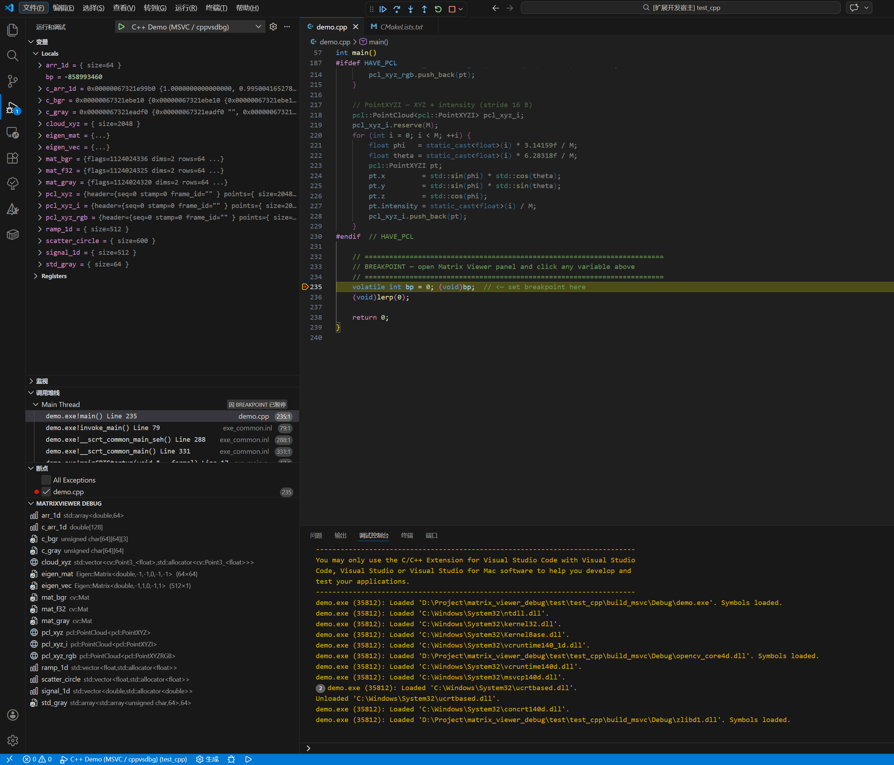
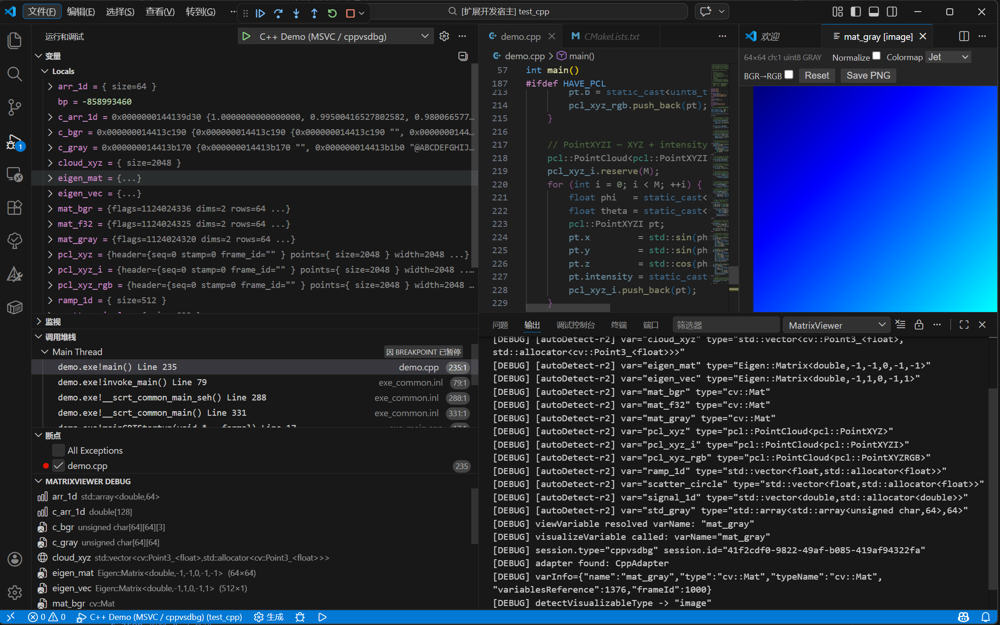
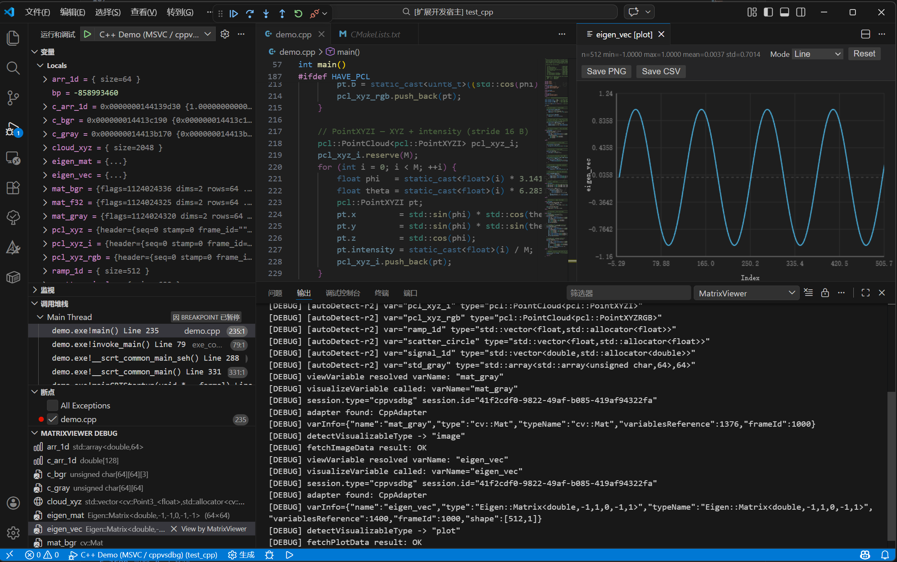
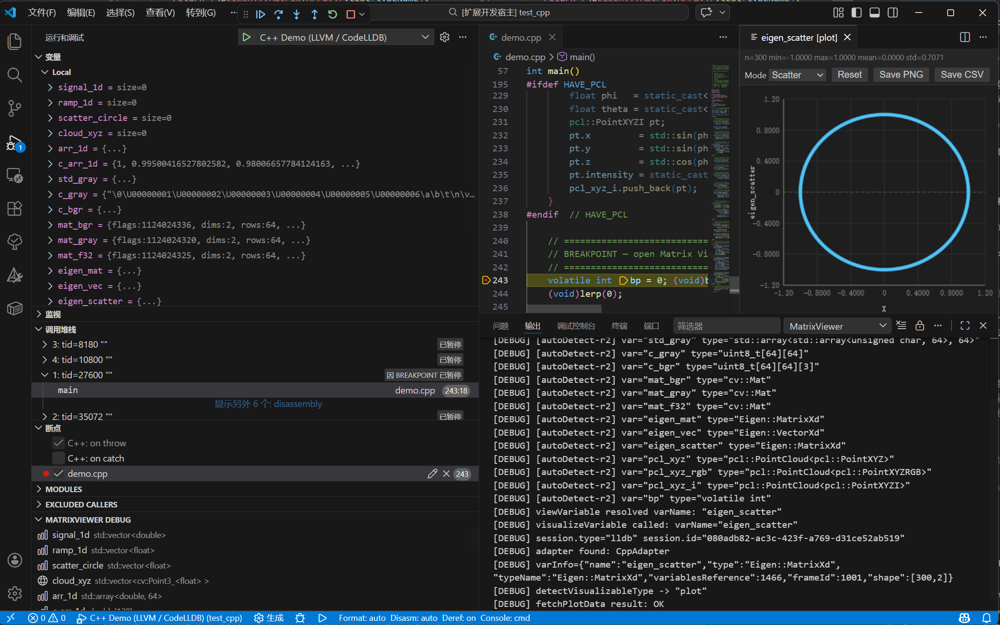
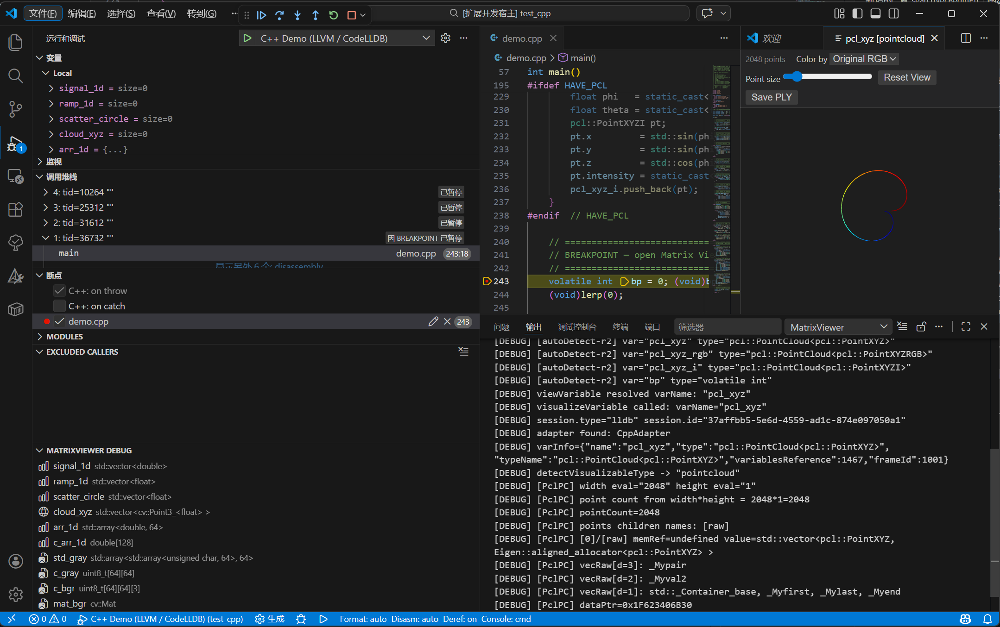
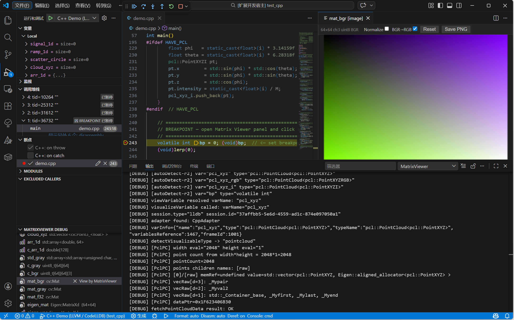

# C++ Usage Guide — Matrix Viewer Debug

[English](cpp.md) | [中文](../../zh/cpp.md)

> **Back to main README**: [README.md](../../../README.md)

---

## Table of Contents

- [Requirements](#requirements)
- [Supported Compilers and Debuggers](#supported-compilers-and-debuggers)
- [Build Configuration](#build-configuration)
  - [LLVM / Clang + CodeLLDB (Windows)](#llvm--clang--codelldb-windows)
  - [GCC + cppdbg (Linux / macOS / WSL)](#gcc--cppdbg-linux--macos--wsl)
  - [MSVC + cppdbg (Windows)](#msvc--cppdbg-windows)
- [launch.json Configuration](#launchjson-configuration)
- [Opening the Variables Panel](#opening-the-variables-panel)
- [Visualizing a Variable](#visualizing-a-variable)
- [Viewer Controls](#viewer-controls)
  - [Image Viewer](#image-viewer)
  - [Plot Viewer](#plot-viewer)
  - [Point Cloud Viewer](#point-cloud-viewer)
- [View Sync](#view-sync)
- [Supported C++ Types](#supported-c-types)
- [Quick-Start Example](#quick-start-example)
- [Troubleshooting](#troubleshooting)

---

## Requirements

| Requirement | Details |
|-------------|---------|
| VS Code | 1.93.0+ |
| Debugger extension | [C/C++](https://marketplace.visualstudio.com/items?itemName=ms-vscode.cpptools) (`ms-vscode.cpptools`) — for `cppdbg`<br>[CodeLLDB](https://marketplace.visualstudio.com/items?itemName=vadimcn.vscode-lldb) (`vadimcn.vscode-lldb`) — for `lldb` |
| Compiler | Clang/LLVM ≥ 14, GCC ≥ 11, or MSVC 2022 |
| Optional libraries | `OpenCV 4`, `Eigen3`, `PCL` — depending on which types you visualize |

---

## Supported Compilers and Debuggers

| Compiler | Debugger | Session Type | Notes |
|----------|----------|--------------|-------|
| Clang/LLVM | CodeLLDB | `lldb` | Requires `-gdwarf-4 -fstandalone-debug` on Windows |
| GCC | cppdbg + gdb | `cppdbg` | Standard DWARF, works out of the box |
| MSVC | cppdbg + vsdbg | `cppdbg` | Limited type inspection; full support requires DWARF |

> **Windows + LLVM + CodeLLDB is the recommended combination.**  
> LLDB has limited PDB (CodeView) support; building with DWARF debug info is required
> for the extension to resolve complex types such as `cv::Mat` or `Eigen::Matrix`.

---

## Build Configuration

### LLVM / Clang + CodeLLDB (Windows)

Add the following CMake flags to embed DWARF debug info:

```cmake
set(CMAKE_CXX_FLAGS_DEBUG "-O0 -gdwarf-4 -fstandalone-debug")
```

Or pass them on the command line:

```powershell
cmake -G Ninja -DCMAKE_BUILD_TYPE=Debug `
  -DCMAKE_CXX_FLAGS_DEBUG="-O0 -gdwarf-4 -fstandalone-debug" `
  ..
```

The `build_llvm.bat` script in the demo project sets these flags automatically:

```bat
test\test_cpp\scripts\bat\build_llvm.bat
```

> `-gdwarf-4` — emit DWARF 4 debug info instead of CodeView/PDB.  
> `-fstandalone-debug` — embed complete type definitions for types from third-party
> (e.g. MSVC-compiled) headers so LLDB can resolve them.

### GCC + cppdbg (Linux / macOS / WSL)

Standard Debug build works without extra flags:

```cmake
cmake -DCMAKE_BUILD_TYPE=Debug ..
make -j$(nproc)
```

### MSVC + cppdbg (Windows)

Build in Debug configuration from Visual Studio or `cmake --build . --config Debug`.  
Type detection works for simple types; `cv::Mat` and other complex types may show limited info.

---

## launch.json Configuration

### CodeLLDB (`"type": "lldb"`)

```jsonc
{
    "name": "C++ (LLVM / CodeLLDB)",
    "type": "lldb",
    "request": "launch",
    "program": "${workspaceFolder}/build_llvm/demo.exe",
    "args": [],
    "cwd": "${workspaceFolder}",
    "stopOnEntry": false,
    "env": {
        // Add vcpkg debug DLL folder and LLVM bin so runtime DLLs are found
        "PATH": "D:/Library/vcpkg/installed/x64-windows/debug/bin;C:/Program Files/LLVM/bin;${env:PATH}"
    }
}
```

> Use `stopOnEntry` (not `stopAtEntry`) — the latter is a `cppdbg`/`cppvsdbg` property
> and will cause a JSON schema error with CodeLLDB.

### cppdbg + gdb (Linux / macOS / WSL)

```jsonc
{
    "name": "C++ (GCC / cppdbg)",
    "type": "cppdbg",
    "request": "launch",
    "program": "${workspaceFolder}/build/demo",
    "args": [],
    "cwd": "${workspaceFolder}",
    "stopAtEntry": false,
    "MIMode": "gdb",
    "miDebuggerPath": "/usr/bin/gdb"
}
```

---

## Opening the Variables Panel

1. Start the debug session (press **F5**) and let it pause at a breakpoint.
2. Open the **Run and Debug** sidebar (`Ctrl+Shift+D`).
3. Find the **MatrixViewer Debug** section — it lists all visualizable variables in the current scope.
4. The list refreshes automatically on every debugger step.



---

## Visualizing a Variable

### Option 1 — MatrixViewer Debug panel (Recommended)

Click any variable name in the **MatrixViewer Debug** panel.

### Option 2 — Context Menu

Right-click a variable in the native **Variables** pane → **View by MatrixViewer**.


### Option 3 — Command Palette

`Ctrl+Shift+P` → **MatrixViewer: View by MatrixViewer** → type the variable name.

---

## Viewer Controls

### Image Viewer

Renders `cv::Mat`, 2D/3D `std::array`, and C-style 2D arrays as a zoomable canvas.

| Action | Control |
|--------|---------|
| Zoom in / out | Scroll wheel |
| Pan | Click and drag |
| Reset view | Click **Reset** button |
| Apply colormap | Colormap dropdown (gray, jet, viridis, hot, plasma) |
| Toggle normalize | **Normalize** checkbox — maps min→0, max→255 |
| Hover pixel info | Move cursor to see `[row, col] = value` |
| Export | Click **Save PNG** |



### Plot Viewer

Renders 1D/2D numeric data as a line chart, scatter chart, or histogram.

| Action | Control |
|--------|---------|
| Zoom | Rectangle-select, or scroll wheel |
| Pan | Click and drag |
| Reset zoom | Double-click |
| Switch mode | **Line / Scatter / Histogram** buttons |
| View stats | Min, Max, Mean, Std displayed below the chart |
| Export PNG | Click **Save PNG** |
| Export CSV | Click **Save CSV** |





### Point Cloud Viewer

Renders 3D point clouds using Three.js + OrbitControls.

| Action | Control |
|--------|---------|
| Rotate | Click and drag |
| Zoom | Scroll wheel |
| Pan | Right-click and drag |
| Reset camera | Click **Reset** button |
| Color by axis | Select **X / Y / Z** in the color dropdown |
| Adjust point size | Use the **Point Size** slider |
| Export PLY | Click **Save PLY** |



---

## View Sync

Pair two open viewer panels so their viewport stays in sync:

1. Open two viewer panels.
2. In either panel, click **Sync** and select the other panel.
3. Moving the viewport in one panel mirrors it in the other.
4. Click **Unsync** to break the pair.

---

## Supported C++ Types

### Image Viewer

| Type | Notes |
|------|-------|
| `cv::Mat` | All depths (CV_8U, CV_16U, CV_32F, …); 1, 3, 4 channels |
| `std::array<std::array<T,W>,H>` | 2D array — treated as grayscale image |
| `T[H][W]` | C-style 2D array — treated as grayscale image |
| `T[H][W][C]` | C-style 3D array — treated as multi-channel image |
| `Eigen::Matrix<T,R,C>` / `Eigen::Array<T,R,C>` | rows > 1 and cols > 2 — rendered as grayscale image, auto-normalised |

### Plot Viewer

| Type | Notes |
|------|-------|
| `std::vector<T>` (numeric T) | 1D line chart |
| `std::array<T,N>` (numeric T) | 1D line chart |
| `T[N]` — C-style 1D array | 1D line chart |
| `Eigen::VectorXd` / `Eigen::VectorXf` | 1D line chart |
| `Eigen::RowVectorXd` / `Eigen::RowVectorXf` | 1D line chart |
| `Eigen::Matrix<T,N,1>` / `Eigen::Matrix<T,1,N>` | 1D line chart |
| `Eigen::Matrix<T,N,2>` | 2D scatter — column 0 = X, column 1 = Y |

**Eigen routing rules** (determined at runtime via `.rows()` / `.cols()`):

| Condition | Viewer |
|-----------|--------|
| `cols == 1` or `rows == 1` | 1D line plot |
| `cols == 2` | 2D scatter (col 0 = X, col 1 = Y) |
| `rows > 1` and `cols > 2` | Image (grayscale, auto-normalised) |

### Point Cloud Viewer

| Type | Notes |
|------|-------|
| `pcl::PointCloud<pcl::PointXYZ>` | XYZ points |
| `pcl::PointCloud<pcl::PointXYZRGB>` | XYZ + per-point RGB |
| `std::vector<cv::Point3f>` / `std::vector<cv::Point3d>` | Each element = one 3D point |
| `std::array<cv::Point3f,N>` / `std::array<cv::Point3d,N>` | Each element = one 3D point |

---

## Quick-Start Example

A ready-to-run C++ demo lives in [`test/test_cpp/`](../../../test/test_cpp/).

1. Install prerequisites:

   ```powershell
   winget install LLVM.LLVM Ninja-build.Ninja Kitware.CMake
   vcpkg install opencv4 eigen3 pcl --triplet x64-windows
   ```

2. Build (Windows + LLVM):

   ```bat
   test\test_cpp\scripts\bat\build_llvm.bat
   ```

3. Open `test/test_cpp` in VS Code, press **F5**, select **C++ Demo (LLVM / CodeLLDB)**.

4. The debugger stops at the breakpoint. Open the **MatrixViewer Debug** panel to see all detected variables.



---

## Troubleshooting

### Process exits immediately with `0xc0000135`

The executable cannot find one or more vcpkg DLLs at startup.  
→ Add the vcpkg `debug/bin` directory to `env.PATH` in `launch.json`:

```jsonc
"env": {
    "PATH": "D:/Library/vcpkg/installed/x64-windows/debug/bin;C:/Program Files/LLVM/bin;${env:PATH}"
}
```

### `cv::Mat` variables not detected (type information missing)

The binary was compiled with CodeView/PDB debug info instead of DWARF.  
→ Rebuild using `-gdwarf-4 -fstandalone-debug` (the `build_llvm.bat` script does this).  
→ Verify: open `build_llvm/CMakeCache.txt` and confirm:

```
CMAKE_CXX_FLAGS_DEBUG:STRING=-O0 -gdwarf-4 -fstandalone-debug
```

### Schema error "属性 stopAtEntry 不允许"

`stopAtEntry` is a `cppdbg`/`cppvsdbg` property and is not recognised by CodeLLDB.  
→ Rename it to `stopOnEntry` in the `"type": "lldb"` launch configuration.

### Variable appears in Variables pane but not in MatrixViewer Debug panel

The type may not yet be detected by Layer-1 quick detection.  
→ Use **Option 3 (Command Palette)** to visualize it by name directly.

> See also: [C++ Windows CodeLLDB Setup Guide](../../cpp-windows-codelldb-setup.md) for a full walk-through.
